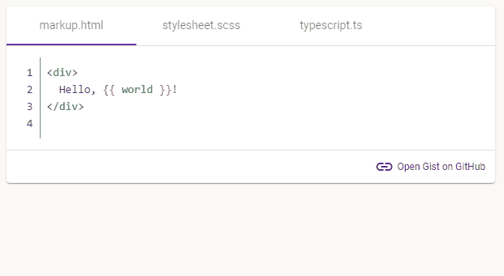

<p align="center">
  <a href="https://www.ProAngular.com" target="_blank">
    
  </a>
  <h1 align="center">
    <a href="https://www.ProAngular.com" target="_blank">
      Pro Angular
    </a>: GitHub gist Code Snippet Tabs
  </h1>
</p>

[](https://www.npmjs.com/@proangular/ngx-gist)
[](https://github.com/ProAngular/ngx-gist)
[](https://github.com/ProAngular/ngx-gist/search?l=typescript)
[](https://www.npmjs.com/@proangular/ngx-gist)
[](https://www.npmjs.com/@proangular/ngx-gist)
[](https://www.npmjs.com/@proangular/ngx-gist)
[](https://bundlephobia.com/result?p=ProAngular/ngx-gist)
[](https://www.ProAngular.com/demos/ngx-gist)
[](https://www.proangular.com)
[](https://gitter.im/ProAngular/community)
[](https://discord.com/channels/1003103094588055552)
[](https://github.com/sponsors/ProAngular)
[](/LICENSE)
[](https://github.com/ProAngular/ngx-gist/actions/workflows/on-merge-main-deploy-gpr.yml)
[](https://github.com/ProAngular/ngx-gist/actions/workflows/on-merge-main-deploy-npmjs.yml)

## Table of Contents

- [Information](#information)
- [Description](#description)
- [Demo](#demo)
- [Installation](#installation)
- [Dependencies](#dependencies)
- [Usage](#usage)
- [Component API](#api)
- [Compatibility](#compatibility)
- [Issues & Contribution](#development)
- [Donations](#donations)
- [License](#license)

<a name="information"/>

## Information 

What is Gist? Gist is an easy method to share snippets or excerpts of data with others. A gist can be a string of code, a bash script or some other small piece of data. These bits of information are hosted by GitHub as a repository.

More info in the following links: 
* Little Known Ways To Utilize GitHub Gists: https://www.liquidweb.com/kb/little-known-ways-to-utilize-github-gists/
* GitHub Docs: https://docs.github.com/en/get-started/writing-on-github/editing-and-sharing-content-with-gists/creating-gists
* Create a gist: https://gist.github.com/

<a name="description"/>

## Description

Behold, this package contains an Angular Material and HighlighJs styled element which displays your GitHub gists in a conveniant, easy to view interface. Don't have a gist? No problem, display your own code snippets by just passing in a direct model (`NgxGist.create({ ... })`)! All files from the remote/local gist are displayed in separate tabs for users to easily navigate. Many optional features and themes are available. 

GitHub gists can be created here: https://gist.github.com/

Enjoy!

<a name="demo"/>

## Demo

<p align="center">
  
</p>

Live demo here: [https://www.ProAngular.com/demos/ngx-gist](https://www.ProAngular.com/demos/ngx-gist)

<a name="installation"/>

## Installation

```bash
ng add @proangular/ngx-gist@latest
```
or
```bash
npm install @proangular/ngx-gist --save
```

Import `NgxGistModule` where needed
```diff
...
+ import { NgxGistModule } from '@proangular/ngx-gist';
...

@NgModule({
  imports: [
    ...
+   NgxGistModule
  ],
  ...
})
export class FeatureModule { }
```

<a name="dependencies"/>

## Dependencies

### Styling UX - Angular Material

 You should have an Angular Material theme set up prior to using this, but it's not strictly neccessary. Disabled by default, you can alternatively use the `materialTheme` component input (see API documentation below) to auto load a pre-defined Angular Material theme from a CDN. I don't recommend depending on the CDN or this approach, but I wanted to make it possible for you. It's also possible to use this without an angular theme and style it yourself entirely!

More information on theming Angular Material: https://material.angular.io/guide/theming

### Styling UX Code Snippets - Highlight.js

You can pass in any theme name (string, excluding the file extension ".css") to the input `codeTheme` on _any_ `ngx-gist` element on a single page which will apply the theme to that pages gists.

You can find the available styles here: https://unpkg.com/browse/highlight.js@11.6.0/styles/

Alternatively if you only want to use one style across the whole project or just apply to specific features, I recommend importing the styles directly. To do this install the `highlight.js` package and apply the style. Example below:

```bash
npm install highlight.js --save
```

```diff
...
+ @import "highlight.js/styles/github.css";
...
```

### Core Packages

Depending on how your project is set up, you may also need the following imports either in your `FeatureModule` for example or your root module (generally these are already imported in `AppModule` or similar, they are common features of Angular). These dependencies are needed for animating the Angular Material tabs click transition and making an HTTP request to GitHub to retrieve the remote gist information.

Try using `ngx-gist` before importing these, you'll know if you need them if you get a console error in the browser.

```diff
...
+ import { BrowserAnimationsModule } from '@angular/platform-browser/animations';
+ import { HttpClientModule } from '@angular/common/http';
...

@NgModule({
  imports: [
    ...
+   BrowserAnimationsModule,
+   HttpClientModule,
  ],
  ...
})
export class AppModule { }
```

See other `peerDependencies` you may need in the package.json in the root of this project.

<a name="usage"/>

## Usage

1. Provide your gist id into the input `gistId`, or
2. Provide a direct `NgxGist` mobdel in the input `gist`.

Note: For example your gist id would be `TH1515TH3G15T1D` in: 

https://gist.github.com/YourUserName/TH1515TH3G15T1D

### Default - fetched gist (auto cached for 24 hours)

ngx-gist will fetch the gist once and store it locally for 24 hours. In that timeframe, if the user returns or visits another page where this gist was previously loaded, it will reload the content without having to reach out to GitHub again.
```html
<ngx-gist gistId="TH1515TH3G15T1D"></ngx-gist>
```

### Fetched gist (forced no cache)

Force no cache. This will force ngx-gist to retrieve the content live from GitHub every time this content loads. This is disabled by default, but could be useful if your gists change frequently.
```html
<ngx-gist
  gistId="TH1515TH3G15T1D"
  [useCache]="false"
></ngx-gist>
```

### Setting the code style theme

Select a "highlight.js" code theme to apply. Note: Only one theme can be loaded on a single page at a time! The first theme to load will apply to all gists on the page.
```html
<ngx-gist
  codeTheme="github"
  gistId="TH1515TH3G15T1D"
></ngx-gist>
```

### Displaying one specific file

Display only one specific file when your gist has many.
```html
<ngx-gist
  displayOnlyFileNames="super.js"
  gistId="TH1515TH3G15T1D"
></ngx-gist>
```

### Displaying multiple, specific files

You can also display any number of specific files by name.
```html
<ngx-gist
  [displayOnlyFileNames]="['csstest.css', 'main.ts']"
  gistId="TH1515TH3G15T1D"
></ngx-gist>
```

### Displaying a basic code snippet (without a remote gist)

These are not fetched from GitHub and are brought in elsewhere from your application (seperate HTTP request, or statically for example). With this method you can display code snippets without having to create a remote gist. You can easily create a new code snippet/gist object using `NgxGist.create({ ... })`. Note: no "Open Gist on GitHub" link will display.
```html
<ngx-gist [gist]="localGistObject"></ngx-gist>
```

### Hiding line numbers

Line numbers are enabled by default, but you can turn them off like so.
```html
<ngx-gist
  gistId="TH1515TH3G15T1D"
  [showLineNumbers]="false"
></ngx-gist>
```

<a name="api"/>

## Component API

| Input Name               | Input Typing                         | Default Value | Description                                                                                                                                                                                                                                                                    |
| ------------------------ | ------------------------------------ | ------------- | ------------------------------------------------------------------------------------------------------------------------------------------------------------------------------------------------------------------------------------------------------------------------------ |
| **codeTheme**            | `HighlightJsTheme \| undefined`      | `undefined`   | The `highlight.js` code theme to use and display. Note: Only _one_ theme can be loaded on a single page at a time! The first theme to load will apply to all gists on the page. Available themes here: https://unpkg.com/browse/highlight.js@11.6.0/styles/                    |
| **displayOnlyFileNames** | `string \| string[] \| undefined`    | `undefined`   | Display in the DOM only the selected filename(s) from the gists files array. Can be either a string or string array. File names much match exactly, be sure to remove any leading or trailing whitespace in the provided strings.                                              |
| **gist**                 | `NgxGist \| undefined`               | `undefined`   | Provide a static gist model here directly which will be displayed if no `gistId` is provided for remote fetching. Also this model will be displayed should a fetch fail when retrieving `gistId`, or overwritten once the pertaining `gistId` data is fetched.                 |
| **gistId**               | `string`                             | `undefined`   | Provide the GitHub gist id to be fetched and loaded. This can be found in URL of the gists you create. For example the id `TH1515TH3G15T1D` in: https://gist.github.com/YourUserName/TH1515TH3G15T1D. Alternatively, provide a value directly in the sibling input `gist`.     |
| **hideGistLink**         | `bool`                               | `false`       | Optionally hide the gist link which opens the gist on GitHub. The gist links automatically display for remote gists, but can be hidden with this feature.                                                                                                                      |
| **materialTheme**        | `MaterialPrebuiltTheme \| undefined` | `undefined`   | Define a material core theme to apply. Ideally, you should already have your global material theme set at the root of your project so try to avoid using this if possible. Note: These are loaded from the CDN: `https://unpkg.com`                                            |
| **showLineNumbers**      | `bool`                               | `true`        | Display or hide the line numbers in your gist code snippets.                                                                                                                                                                                                                   |
| **useCache**             | `bool`                               | `true`        | Cache the GitHub gist request in local memory for 24 hours. GitHub has a request limit, so this helps in reducing bandwidth. Loads previously fetched gist content from the users machine on refresh and page re-visits.                                                       |

<a name="compatibility"/>

## Compatibility

| Angular version | @proangular/ngx-gist       | Install                              |
| --------------- | -------------------------- | ------------------------------------ |
| v16             | v1.2.x                     | `ng add @proangular/ngx-gist@latest` |
| v15             | v1.1.x                     | `ng add @proangular/ngx-gist@1.1.0` |
| v14             | v1.0.x                     | `ng add @proangular/ngx-gist@1.0.8`  |
| v13             | v1.0.x                     | `ng add @proangular/ngx-gist@1.0.8`  |
| v12             | v1.0.x                     | `ng add @proangular/ngx-gist@1.0.8`  |

<a name="development"/>

## Issues & Contribution

Please submit all issues, and feature requests here: [https://github.com/ProAngular/ngx-gist/issues](https://github.com/ProAngular/ngx-gist/issues)

Contribution:

1. Clone the repo and create a new branch:
  * `git clone https://github.com/ProAngular/ngx-gist.git`
  * `git checkout -b username/feature-or-bug-description`
2. Bump up the version of package in `package.json` and `package-lock.json`, commit all changes, push.
  * `git add -A`
  * `git commit -m "My commit message"`
  * `git push origin username/feature-or-bug-description`
3. Submit code in published PR for review and approval. Add a good description and link any possible user stories or bugs.
  * [Create a new pull request](https://github.com/ProAngular/ngx-gist/compare).
4. Allow CI actions to completely run and verify files.
5. Add/ping reviewers and await approval.

Thank you for any and all contributions!

<a name="donations"/>

## Donation

As a husband and father of four children, your donations mean the world to me! Any donations are greatly appreciated and keep me going!
* [https://github.com/sponsors/ProAngular](https://github.com/sponsors/ProAngular)
* [https://www.paypal.me/CodyTolene](https://www.paypal.me/CodyTolene)

<a name="license"/>

## License

Copyright &copy; 2022 [Cody Tolene](https://www.CodyTolene.com)

All content is licensed under the [MIT license].

[mit license]: LICENSE
